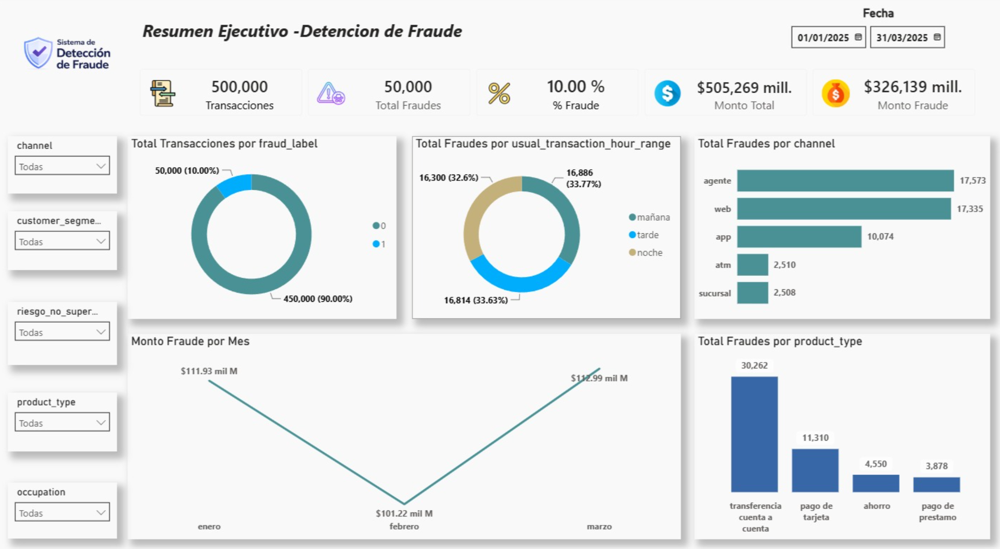
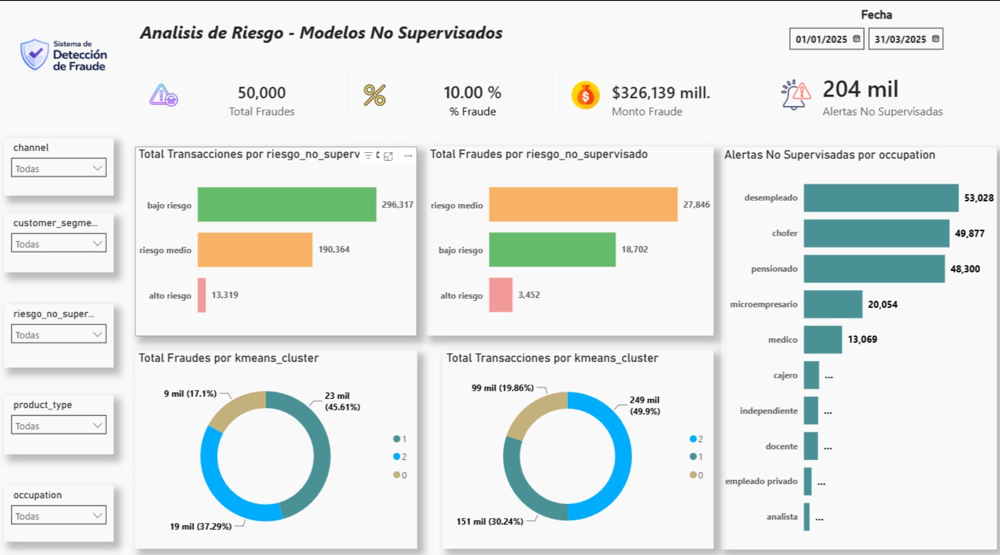
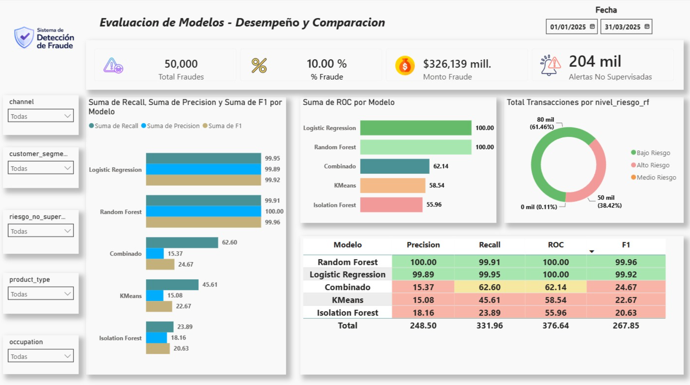

<div align="center">

# Detección Inteligente de Fraude Financiero
### Machine Learning · Análisis de Riesgo · Business Intelligence


**Proyecto Final · Talendig 1ra Cohorte · Carrera Técnica en Data Science**

</div>

---

# 📋 Descripción General

Este proyecto implementa una plataforma integral de detección de fraude financiero que combina calidad de datos, análisis exploratorio, detección de anomalías, Machine Learning supervisado y no supervisado, y visualización ejecutiva en Power BI.

La solución fue desarrollada sobre un dataset sintético de más de **600,000 registros**, diseñado para simular escenarios reales de instituciones financieras, incluyendo transacciones válidas, transacciones fraudulentas y registros con problemas de calidad de datos.

El sistema aprende patrones de comportamiento histórico de los clientes, identifica transacciones que se desvían de esos patrones y genera información accionable para equipos de riesgo, auditoría y cumplimiento.

> **Variable objetivo:** `fraud_label`
>
> - `0` = Transacción legítima
> - `1` = Transacción fraudulenta

---

# 🎯 Objetivos del Proyecto

1. Construir un pipeline completo de preparación y calidad de datos financieros.
2. Comparar enfoques supervisados y no supervisados para detección de fraude.
3. Implementar mecanismos de detección de anomalías.
4. Generar indicadores de riesgo comprensibles para usuarios de negocio.
5. Desarrollar dashboards ejecutivos en Power BI.
6. Documentar decisiones técnicas bajo criterios estadísticos y financieros.

---

# 🏦 Contexto del Problema

Las instituciones financieras procesan diariamente miles de transacciones a través de canales digitales y presenciales.

Entre estas operaciones pueden existir actividades fraudulentas que generan:

- Pérdidas económicas
- Riesgos regulatorios
- Costos operativos
- Impacto reputacional

Este proyecto busca demostrar cómo la Ciencia de Datos puede utilizarse para identificar patrones de fraude, detectar anomalías y apoyar la toma de decisiones mediante modelos analíticos y visualización ejecutiva.

---

# 📊 Dataset

El proyecto utiliza un dataset sintético diseñado específicamente para fines académicos y de simulación financiera.

## Composición

| Concepto | Cantidad |
|-----------|-----------|
| Clientes simulados | 7,000 |
| Transacciones válidas | 500,000 |
| Registros con problemas de calidad | 100,000 |
| Total de registros | 600,000 |
| Transacciones fraudulentas | 50,000 |
| Transacciones legítimas | 450,000 |

## Ventana Temporal

El comportamiento se modela sobre una ventana de **3 meses**.

- Inicio: 2025-01-01
- Fin: 2025-03-31

## Productos Financieros

- Ahorro
- Pago de préstamo
- Pago de tarjeta
- Transferencia cuenta a cuenta

## Canales

- Web
- App
- Agente
- ATM
- Sucursal

---

# 🔍 Diseño del Fraude

Las transacciones fraudulentas fueron diseñadas como anomalías respecto al comportamiento histórico del cliente.

Se consideraron señales como:

- Montos significativamente superiores al promedio histórico.
- Uso de canales no habituales.
- Productos financieros poco frecuentes.
- Horarios distintos al comportamiento normal.
- Incremento del nivel de riesgo.

Esto permitió construir escenarios de fraude coherentes con situaciones observadas en entornos financieros reales.

---

# 🗂️ Estructura del Repositorio

```text
[NombreRepo]/
│
├── limpiezaDeDatosDefinitivo.ipynb
├── generate_financial_transactions_dataset.py
│
├── data/
│   ├── transactions_cleaned.csv
│   ├── dashboard_fraude_final.csv
│   └── metricas_modelos.csv
│
├── dashboards/
│   └── .pbix
│
├── docs/
│   └── DocumentacionTecnica_FraudeFinanciero.docx
│
├── images/
│   ├── dashboard_resumen.png
│   ├── dashboard_riesgo.png
│   └── dashboard_modelos.png
│
└── README.md
```

---

# ⚙️ Pipeline del Proyecto

```text
Dataset (600,000 registros)
            │
            ▼
Calidad y Preparación de Datos
            │
            ▼
Análisis Exploratorio (EDA)
            │
            ▼
Modelos No Supervisados
(Isolation Forest + K-Means)
            │
            ▼
Modelos Supervisados
(Logistic Regression + Random Forest)
            │
            ▼
Exportación para Power BI
            │
            ▼
Dashboard Ejecutivo
```

---

# 🧹 Calidad y Preparación de Datos

Durante esta fase se realizaron:

- Validación estructural del dataset.
- Revisión de duplicados.
- Estandarización de variables categóricas.
- Conversión y validación de fechas.
- Diagnóstico de valores nulos.
- Ajuste de variables numéricas.
- Identificación de outliers mediante IQR.

## Principio rector

> Preservar información antes que eliminarla.

### Duplicados

Los registros duplicados fueron identificados y marcados para auditoría.

No fueron eliminados automáticamente debido a que dos transacciones similares pueden representar operaciones legítimas independientes.

### Outliers

Los valores extremos fueron preservados porque constituyen una de las señales más relevantes para la detección de fraude.

### Registros con problemas de calidad

El dataset contiene 100,000 registros con:

- Valores nulos
- Duplicados
- Formatos inválidos
- Categorías incorrectas
- Inconsistencias de negocio

Estos registros fueron conservados dentro del proyecto para fines de auditoría, exploración y validación de reglas de negocio.

Sin embargo, los modelos fueron entrenados únicamente utilizando registros marcados como:

```text
data_quality_flag = valid
```

garantizando consistencia durante el aprendizaje.

---

# 📈 Análisis Exploratorio de Datos (EDA)

Una vez completada la preparación de datos se realizó un análisis exploratorio para identificar patrones asociados al fraude.

## Hallazgos Principales

### Canales con mayor incidencia de fraude

Los canales:

- Web
- App
- Agente

concentraron la mayor cantidad de transacciones fraudulentas.

Esto sugiere una mayor exposición al riesgo en canales digitales y de atención indirecta.

### Producto financiero más afectado

Las:

```text
Transferencias cuenta a cuenta
```

presentaron la mayor concentración de fraude dentro del conjunto de datos.

### Comportamiento anómalo

Las transacciones fraudulentas mostraron patrones significativamente distintos al comportamiento histórico del cliente:

- Cambios de canal
- Cambios de horario
- Montos atípicos

### Variables de riesgo

Las variables:

- risk_score
- risk_profile
- anomaly_flag

mostraron una fuerte correlación con la variable objetivo.

Por esta razón fueron excluidas del entrenamiento para prevenir Data Leakage.

---

# 🚫 Prevención de Data Leakage

Uno de los aspectos más importantes del proyecto fue evitar que los modelos accedieran a información derivada del proceso de generación del fraude.

Se excluyeron las siguientes variables:

```python
columnas_excluidas = [
    "fraud_label",
    "anomaly_flag",
    "risk_score",
    "risk_profile",
    "deviation_from_usual_amount_pct",
    "data_quality_flag",
    "transaction_id",
    "customer_id",
    "transaction_datetime",
    "transaction_date",
    "transaction_time"
]
```

Incluir estas variables habría producido métricas artificialmente elevadas y modelos poco realistas.

---

# 📌 Variables Utilizadas

## Variables Predictoras

- transaction_amount
- product_type
- channel
- transaction_status
- transaction_direction
- customer_segment
- occupation
- industry
- employment_type
- monthly_income
- income_frequency
- customer_tenure_months
- avg_3m_transaction_amount
- avg_3m_transaction_count
- usual_product_type
- usual_channel
- usual_transaction_hour_range

## Variable Objetivo

```text
fraud_label
```

---

# 🤖 Modelos Implementados

## Modelos No Supervisados

### Isolation Forest

Detecta anomalías mediante árboles aleatorios que aíslan observaciones atípicas.

### K-Means

Agrupa transacciones con características similares para identificar segmentos de riesgo.

> Para este proyecto se utilizaron 3 clusters debido a su alineación con los niveles de riesgo definidos (bajo, medio y alto). Futuras versiones podrían validar este parámetro mediante Elbow Method o Silhouette Score.

### Modelo Combinado

Se desarrolló un score híbrido utilizando:

- Isolation Forest
- K-Means

con el objetivo de fortalecer la detección de comportamientos sospechosos.

---

## Modelos Supervisados

### Logistic Regression

Modelo base utilizado por su interpretabilidad y capacidad para estimar probabilidades de fraude.

### Random Forest ⭐

Modelo seleccionado por su capacidad para capturar relaciones complejas entre variables y maximizar el desempeño predictivo.

---

# 📊 Resultados

## Comparación de Modelos

| Modelo | Tipo | Recall | Precision | F1 Score | ROC AUC |
|----------|----------|----------|----------|----------|----------|
| Isolation Forest | No Supervisado | 23.89% | 18.16% | 20.63% | 55.96% |
| K-Means | No Supervisado | 45.61% | 15.08% | 22.67% | 58.54% |
| Combinado (IF + KM) | No Supervisado | 62.60% | 15.37% | 24.67% | 62.14% |
| Logistic Regression | Supervisado | 99.95% | 99.89% | 99.92% | 100% |
| Random Forest ⭐ | Supervisado | 99.91% | 100.00% | 99.96% | 100% |

> ⚠️ **Importante**
>
> El dataset utilizado fue generado sintéticamente y los patrones de fraude fueron diseñados de forma explícita.
>
> Por esta razón, las métricas cercanas al 100% deben interpretarse como una validación metodológica y académica, no como una expectativa de desempeño en producción.

### ¿Por qué Recall es la métrica más importante?

Recall representa la capacidad del modelo para detectar fraudes reales.

```text
Recall = TP / (TP + FN)
```

En detección de fraude, un falso negativo representa una pérdida económica potencial, por lo que minimizar este tipo de error es prioritario.

---

# 📈 Dashboard Power BI

## Resumen Ejecutivo

- Volumen de transacciones
- Tasa de fraude
- Monto total procesado
- Monto asociado a fraude



---

## Análisis de Riesgo

- Segmentación de riesgo
- Alertas generadas
- Resultados de modelos no supervisados



---

## Evaluación de Modelos

- Precision
- Recall
- F1 Score
- ROC AUC



---

# 🛠️ Tecnologías Utilizadas

| Categoría | Herramienta |
|-----------|-------------|
| Lenguaje | Python |
| Manipulación de Datos | Pandas, NumPy |
| Machine Learning | Scikit-Learn |
| Visualización Exploratoria | Matplotlib |
| Business Intelligence | Power BI |
| Entorno | Jupyter Notebook |

---

# 🔥 Principales Aprendizajes

- Diseño de pipelines completos de Ciencia de Datos.
- Calidad de datos en entornos financieros.
- Prevención de Data Leakage.
- Detección de anomalías.
- Machine Learning Supervisado y No Supervisado.
- Interpretación de métricas de clasificación.
- Construcción de dashboards ejecutivos.
- Comunicación efectiva de resultados para negocio.

---

# ⚠️ Limitaciones

- Dataset completamente sintético.
- Patrones de fraude predefinidos.
- Ausencia de validación cruzada.
- K-Means sin optimización formal de clusters.
- Algunas métricas exportadas manualmente.
- No se utilizaron datos reales de producción.

---

# 👥 Equipo

Proyecto desarrollado como trabajo final de la Carrera Técnica en Data Science.


---

# 🚀  Instalación y Ejecución 

## 1. Clonar el repositorio

```bash
git clone https://github.com/USUARIO/limpieza-datos-modulo10.git
cd fraud-detection
```

## 2. Instalar dependencias

```bash
pip install pandas numpy scikit-learn matplotlib seaborn openpyxl
```

Todo el proyecto puede reproducirse ejecutando únicamente:

1. generate_financial_transactions_dataset.py
2. limpiezaDeDatosDefinitivo.ipynb

El notebook genera automáticamente los datasets procesados, las métricas de evaluación y los archivos necesarios para Power BI.

---
# 📄 Licencia

Proyecto desarrollado con fines académicos.

El dataset utilizado es completamente sintético y no contiene información financiera real de personas ni instituciones.

---

<div align="center">

**Proyecto Final · Talendig 1ra Cohorte · Data Science**

*Detección de Fraude Financiero con Machine Learning y Power BI*

</div>
